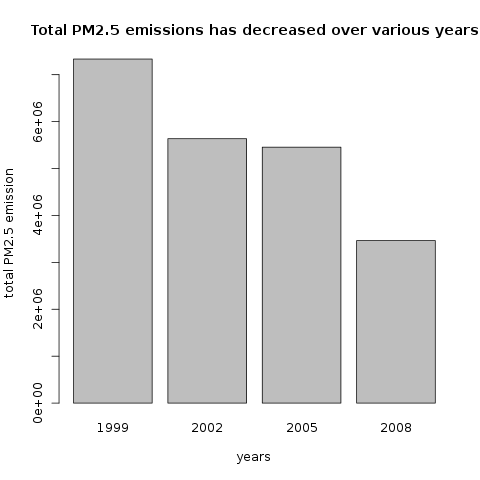
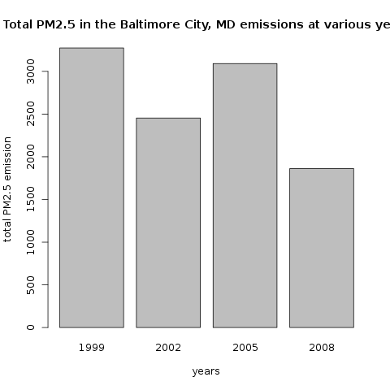
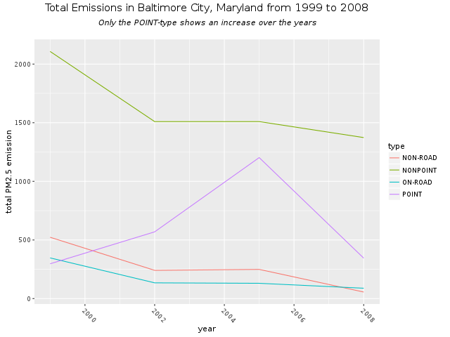
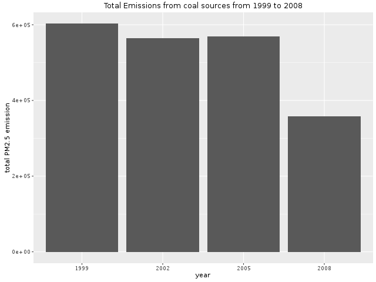
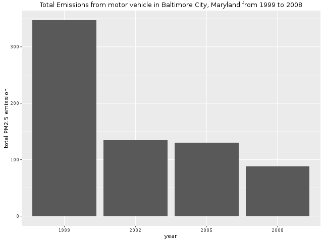
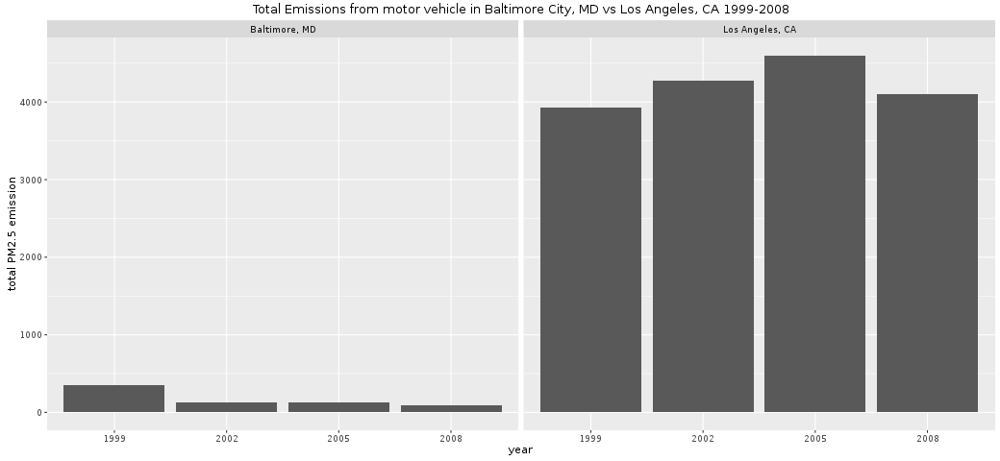

* Introduction

As part of the coursera course "Exploratory Data Analysis" we took a look at the Fine particulate matter (PM2.5) dataset. This dataset is known as the National
Emissions Inventory (NEI). You can read more information about the NEI at the
[[http://www.epa.gov/ttn/chief/eiinformation.html][EPA National Emissions Inventory web site]].

Goal was to answer all of the questions below with a graph. 

* Questions

- Have total emissions from PM_{2.5} decreased in the United States from 1999 to
  2008?

  

- Have total emissions from PM_{2.5} decreased in the Baltimore City, Maryland
  from 1999 to 2008?

  

- Of the four types of sources indicated by the =type= (point, nonpoint, onroad,
  nonroad) variable, which of these four sources have seen decreases in
  emissions from 1999-2008 for Baltimore City? Which have seen increases in
  emissions from 1999-2008? 

  

- Across the United States, how have emissions from coal combustion-related
  sources changed from 1999-2008?

  

- How have emissions from motor vehicle sources changed from 1999-2008 in
  Baltimore City?

  

- Compare emissions from motor vehicle sources in Baltimore City with emissions
  from motor vehicle sources in Los Angeles County, California. Which city has
  seen greater changes over time in motor vehicle emissions?

  
